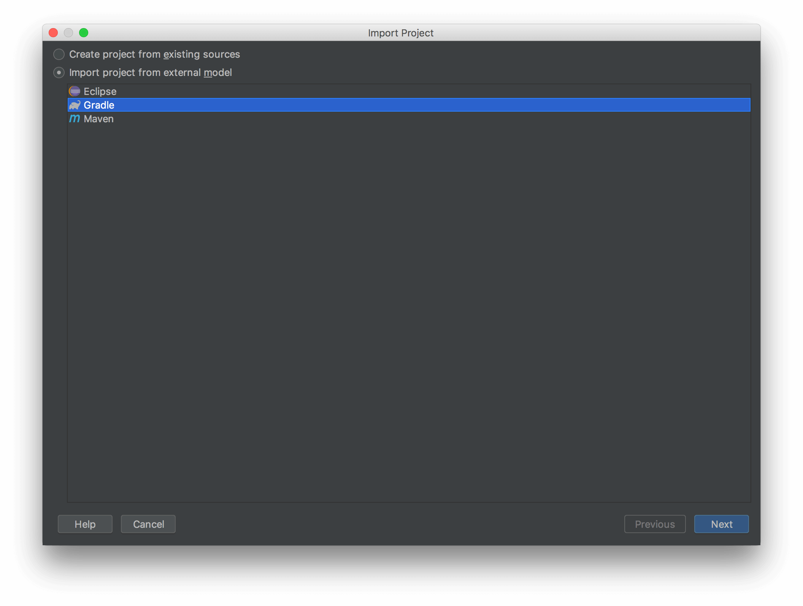
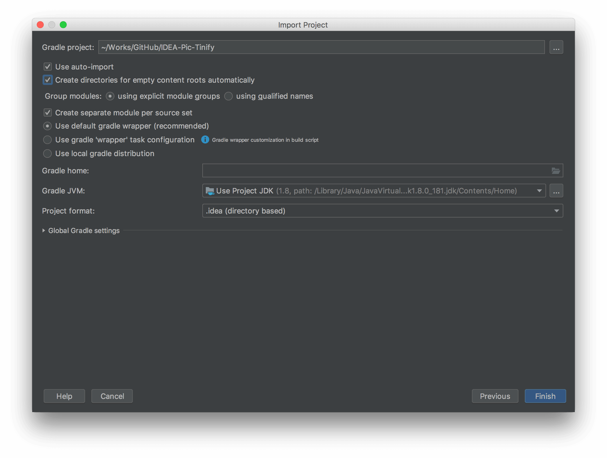

Plugin Contribute Guide
===

### Build project

1. Download sources from repository  

2. Then import it into `IDEA` with main menu `Import Project`  

3. Select `Gradle` under the option 'Import project from external model'  
  

4. Check options 'Use auto-import' and 'Create directorie …', and use default gradle wrapper with recommended  
  

5. OK, build it !
