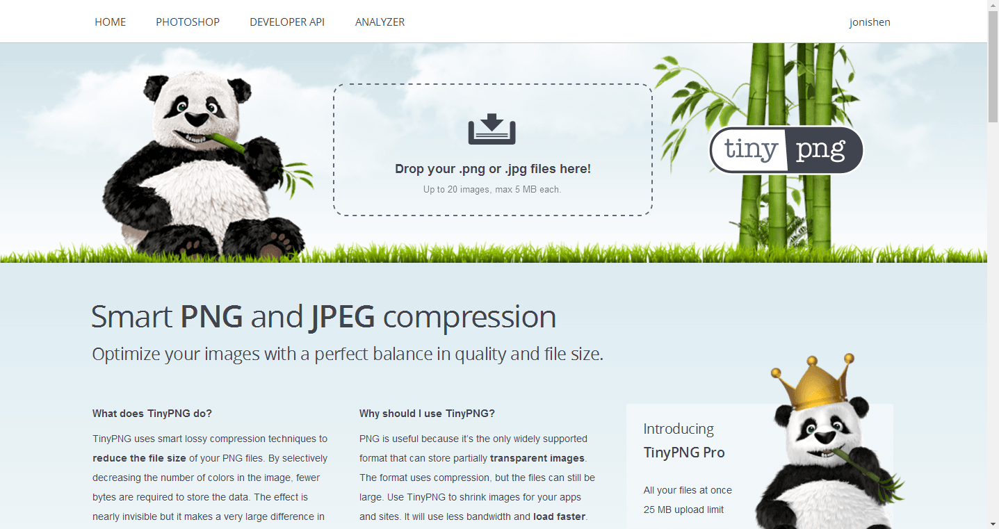
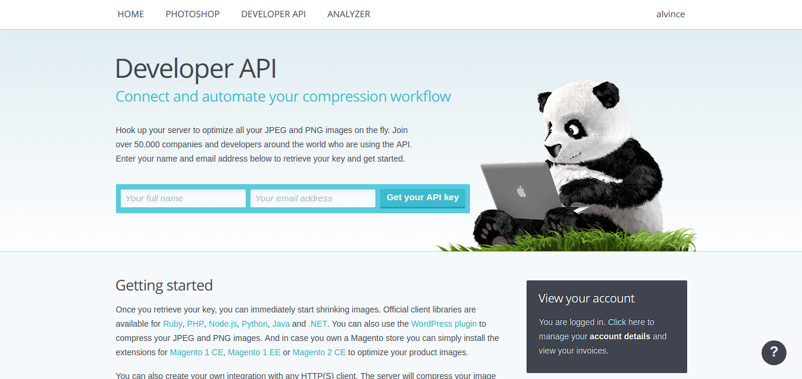
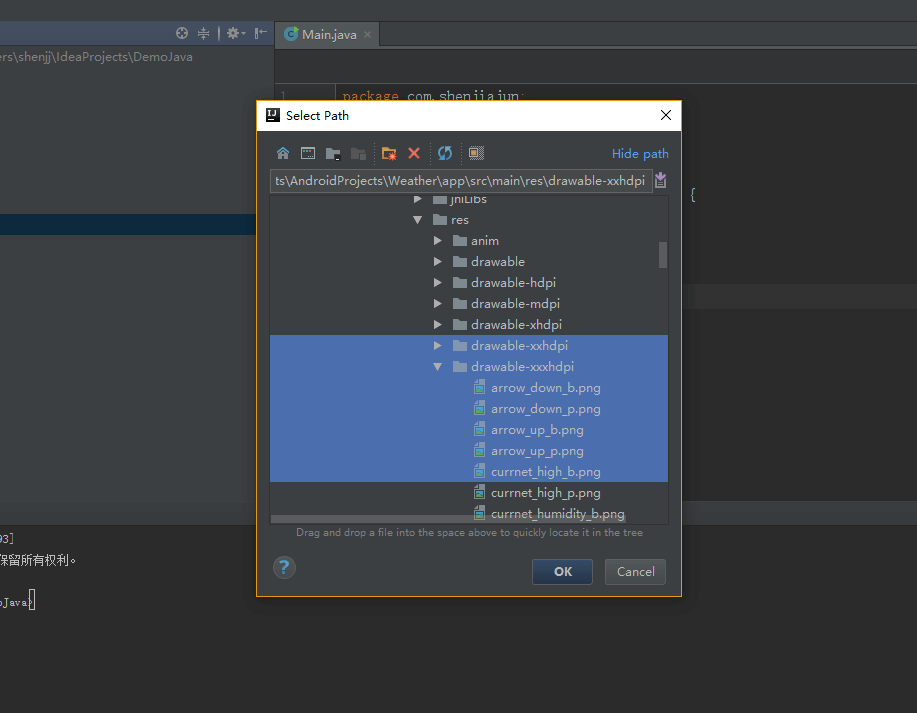

# TinyPic
## 快速压缩图片的 Intellij 插件
压缩功能由TinyPng网站提供 https://tinypng.com/

但是这个网站一次只能上传20张图片，所以你需要上传下载，上传下载重复工作。

#### 申请 Api Key
>在开发者页面下申请api key。  
对于一个key，每月有500次的免费压缩额度，如果压缩超过了500张图片，就不能使用了。增加额度需要另外付费。  
但是申请这个api特别简单，填下邮箱，用户名就行，多申请两个邮箱。1000张图片也妥妥够了。

## 安装 & 使用

1.在File->Settings->Plugins里安装，点击这里➡️[下载](https://github.com/alvince/TinyPic2/releases "v1.0.2")

2.安装完后重启，第一次使用会提示设置 Api Key

3.输入在 https://tinypng.com/developers 申请的api key

4.选择图片（多选，只接受 `png` `jpg`），完成图片压缩

