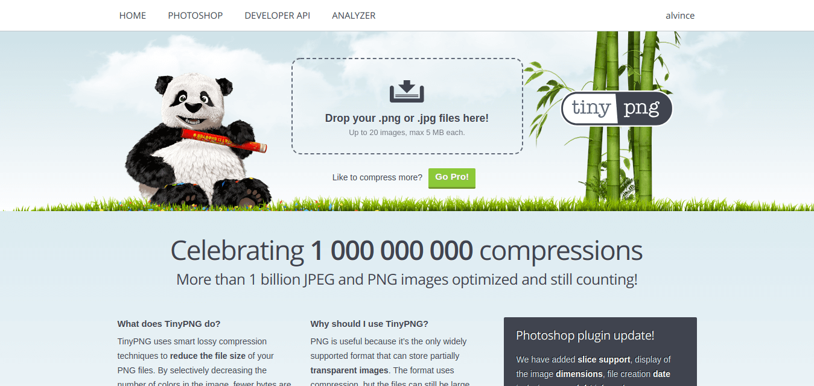
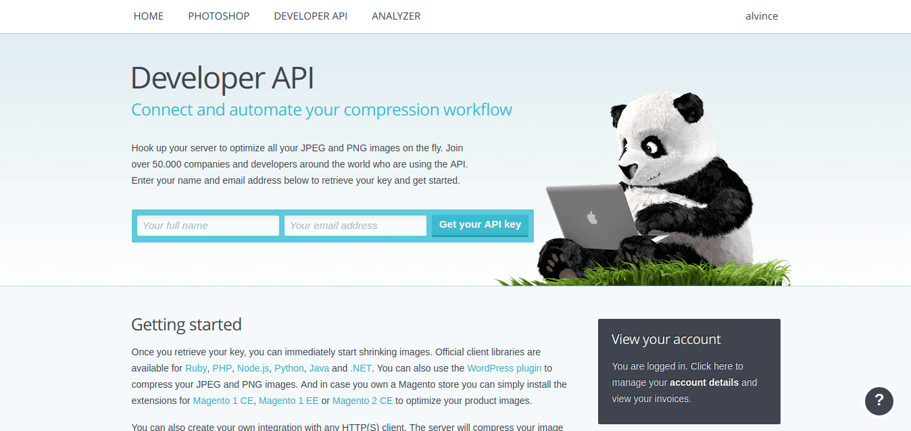
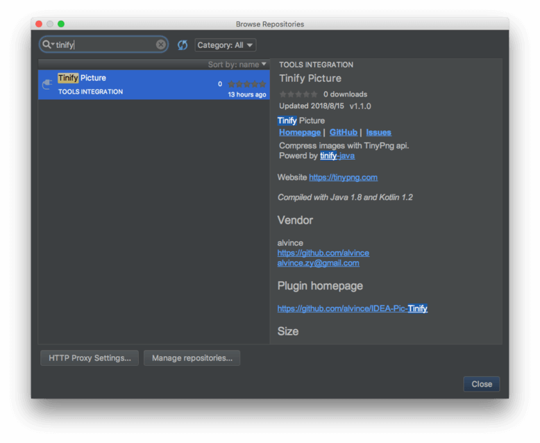
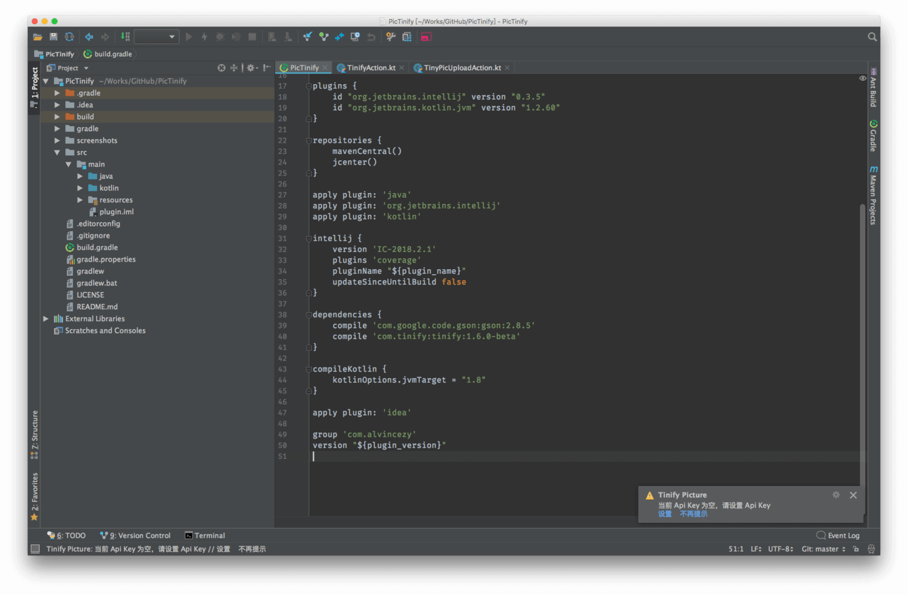
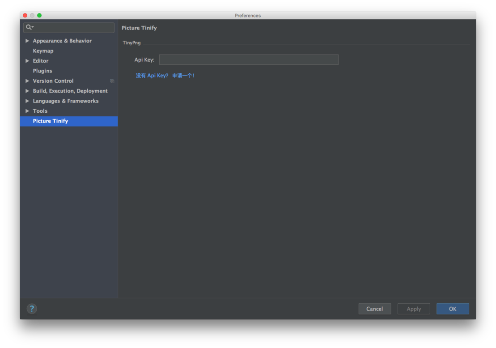
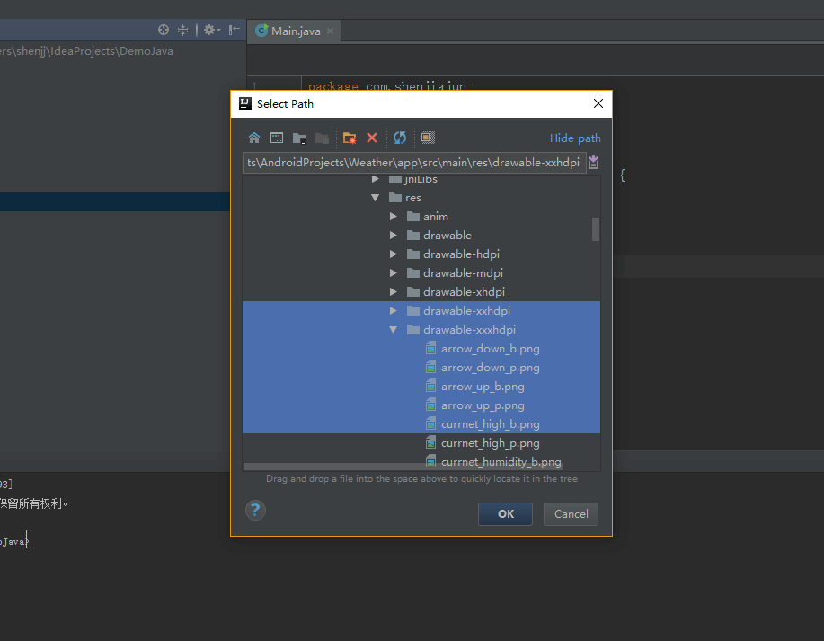
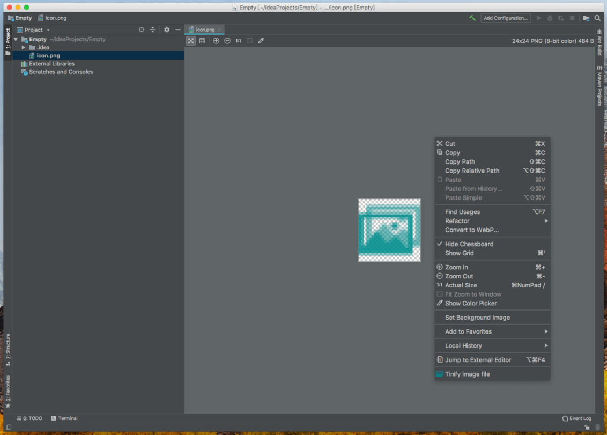
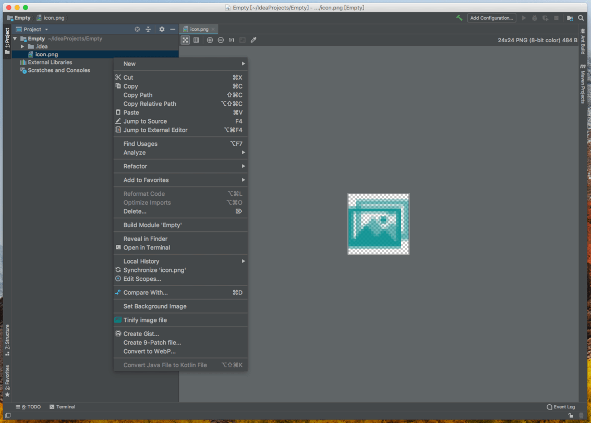

IDEA-Pic-Tinify
===

<p>
<a href="https://plugins.jetbrains.com/plugin/11025-tinify-picture">
  
</a>
<a href="https://www.apache.org/licenses/LICENSE-2.0">
  
</a>
<a href="https://codeclimate.com/github/alvince/IDEA-Pic-Tinify/maintainability">
  
</a>
</p>

### 快速压缩图片的 Intellij 插件

🔗 [SNAPSHOT](README-SNAPSHOT.md)  

压缩功能由 TinyPng 网站提供 https://tinypng.com/ —— powerd by [tinify-java](https://github.com/tinify/tinify-java)



网站 web 端一次只能上传 20 张图片，手动操作需要重复上传下载解压。

#### 申请 Api Key

> 在开发者页面 [tinypng](https://tinypng.com/developers) 申请 api key。  
单个 api key 每月有 500 次的免费压缩额度，增加额度需要另外付费。



## 安装 & 使用

### Install

- 本地安装，点击这里️ 👉 [下载](https://github.com/alvince/IDEA-Pic-Tinify/releases/latest "latest")

- 在线安装 [Plugin repository](https://plugins.jetbrains.com/plugin/11025-tinify-picture)  
  IDE 插件设置搜索 `tinify` 可以看到查询结果 => `Tinify Picture`  
  

### Usage

1. 安装完后重启，第一次使用会提示设置 Api Key  


2. 输入在 [developers](https://tinypng.com/developers) 申请的 api key  


3. 选择图片（可多选，接受 `png` `jpg` 文件类型），自动上传压缩保存（覆盖）  


4. 快速操作  
  可在图片编辑器右键菜单、项目文件 及 版本控制面板的 `Local Changes` 视图中  
  文件右键菜单选择 "Tinify image file" 直接压缩图片  
  
  


To-do
---

- [x] 增加压缩耗时/大小信息统计
- [x] 备份原图
- [x] 批量压缩图片记住上次选择路径

LICENSE
---

```
Copyright 2018 alvince

Licensed under the Apache License, Version 2.0 (the "License");
you may not use this file except in compliance with the License.
You may obtain a copy of the License at

    http://www.apache.org/licenses/LICENSE-2.0

Unless required by applicable law or agreed to in writing, software
distributed under the License is distributed on an "AS IS" BASIS,
WITHOUT WARRANTIES OR CONDITIONS OF ANY KIND, either express or implied.
See the License for the specific language governing permissions and
limitations under the License.
```
